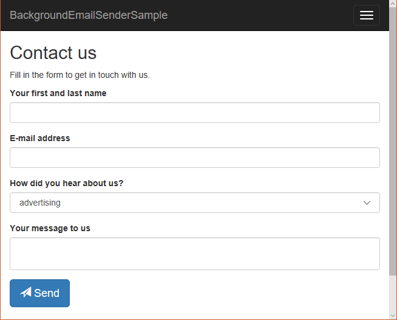

# Background email sender sample
This is a contact form ASP.NET Core 3.1 application. E-mail messages are not sent right away, but they are pushed to a queue managed by an **ASP.NET Core Hosted Service**. This means the client won't have to wait for the actual delivery. Each message is then dequeued and delivered in background. In case of an error during delivery, a message is re-queued for later processing.

Check out the actual Hosted Service implementation in the code file [HostedServices/EmailSenderHostedService.cs](HostedServices/EmailSenderHostedService.cs).

The Hosted Service has to be registered int the `ConfigureServices` method of the `Startup` class. Take a look at the [Startup.cs](Startup.cs#L29) file.

## Dependencies
This project uses the `MailKit` package to deliver emails. The Hosted Service implements the `IEmailSender` interface from the `Microsoft.AspNetCore.Identity.UI` but you can make it implement some other similar interface if you don't want to depend upon ASP.NET Core Identity.

## Warning
This code is **NOT production-ready**. It just illustrates how to implement and register a Hosted Service for sending e-mails in background. Some messages might be lost when the application is restarted since it does not implement a persistent storage (e.g. a database).
Moreover, it does NOT deliver email messages in parallel or throttle them to prevent reaching a quota.

## Getting started
Edit the [appsettings.json](appsettings.json) file with your SMTP server data. Then, just run the application by typing `dotnet run`. The .NET Core SDK 3.1 (or greater) must be installed in your system. Fill in the form and hit the Send button.

